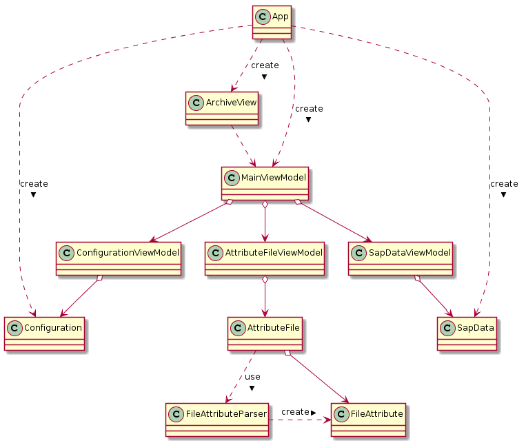

Software Architektur
====================

Das Programm *DvsSapLink2* ist in C# geschrieben und verwendet *WPF*
als User Interface Framework. Um eine saubere Trennung zwischen
Daten, Logik und Darstellung zu erreichen ist die Applikation
nach dem *MVVM* (Model, View, ViewModel) Prinzip geschrieben.

Bootstrapper
------------
Die `App` Klasse hat die zentrale Rolle des *Bootstrappers*. Sie
erledigt folgende Aufgaben:

  * Kommandozeilenargumente lesen
  * Passende Model Klassen instanzieren
  * `MainViewModel` erstellen
  * Daten-Kontext für `ArchiveView` setzen

Sobald dies erledigt ist wird die *View* angezeigt und die *ViewModels*
erledigen die Arbeit.

Model
-----
Die *Model* Klassen habe die Funktion von Data Transfer Objects (DTO).
Sie speichern die Konfigurations- und Input Daten zwischen so dass die
Logik in den ViewModels diese verwenden können.

View
----
Die *View* ist bei der WPF Applikation in *XAML* geschrieben. Alle
Verweise auf Datenfelder und Befehle werden durch sogenannte
*Bindings* umgesetzt. Es gibt keine Verweise aus dem Sourcecode
in die View und auch keine direkten Bindings aus der *View* in das *Model*.

ViewModel
---------
Das *ViewModel* erledigt die meiste Arbeit von `DvsSapLink2`.
Das *ViewModel* bietet also alle Datenfelder für die *Bindings*
in der *View* an und verknüpft diese mit dem *Model*. Auch alle Kommandos
werden für die *Bindings* angeboten, so dass die Aktionen von
der *View* her ausgeführt werden können.
Um die *Bindings* einfacher umzusetzen wird das NuGet Packet
*MvvmLight* eingesetzt.

Klassendiagram
--------------

Das folgende Klassendiagramm zeigt den Aufbau von `DvsSapLink2`:

