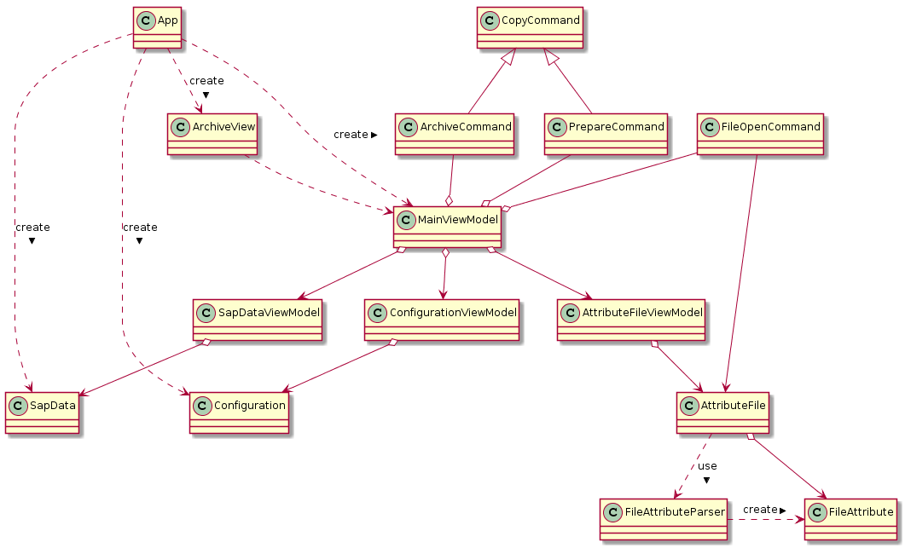

Software Architektur
====================

Das Programm DvsSapLink2 ist in C# geschrieben und verwendet WPF
als User Interface Framework. Um eine saubere Trennung zwischen
Daten, Logik und Darstellung zu erreichen ist die Applikation
nach dem MVVM (Model, View, ViewModel) Prinzip umgesetzt.

Bootstrapper
------------
Die `App` Klasse hat die zentrale rolle des *Bootstrappers*. Sie
erledigt folgende aufgaben:

  * Kommandozeilenargumente lesen
  * Passende Model Klassen instanzieren
  * `MainViewModel` erstellen
  * Daten-Kontext für `ArchiveView` setzen

Sobald dies erledigt ist wird die View angezeigt und die ViewModels
erledigen die Arbeit.

Model
-----
Die Model Klassen habe die Funktion von Data Transfer Objects (DTO).
Sie haben die Aufgabe alle Konfigurations- und Input Daten
zwischenzuspeichern so dass die Logik diese verwenden kann.

View
----
Die View ist bei der WPF Applikation in XAML geschrieben. Alle
Verweise auf Datenfelder und Befehler werden durch sogenannte
*Bindings* umgesetzt. Es gibt keine Verweise aus dem Sourcecode
in die View.

ViewModel
---------
Das ViewModel erledigt die meiste Arbeit von `DvsSapLink2`.
Das ViewModel bietet also alle Datenfelder für die View Bindings
an und verknüpft diese mit dem Model. Auch alle Kommandos
werden für die Bindings angeboten, so dass die Aktionen von
der View her ausgeführt werden können.

Um die Bindings einfacher umzusetzen wird das NuGet Packet
*MvvmLight* eingesetzt.

Klassendiagram
--------------

Das folgende Klassendiagramm zeigt den Aufbau von DvsSapLink2:

